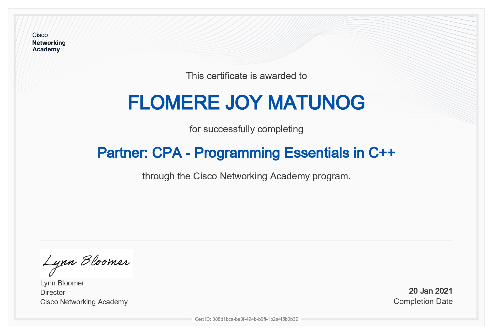
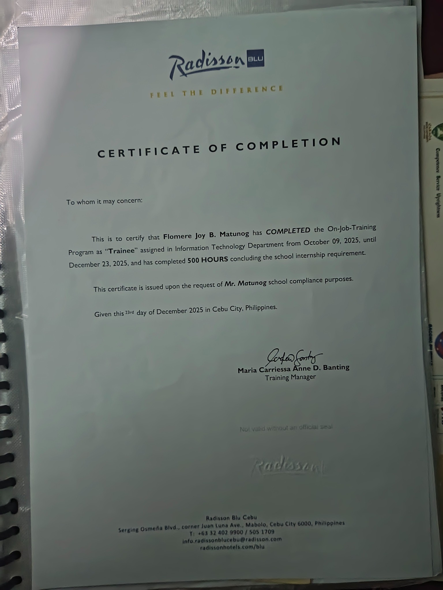
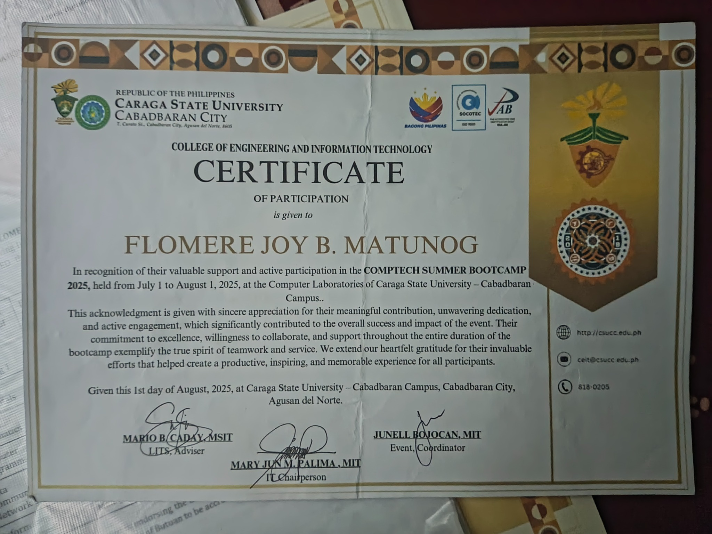
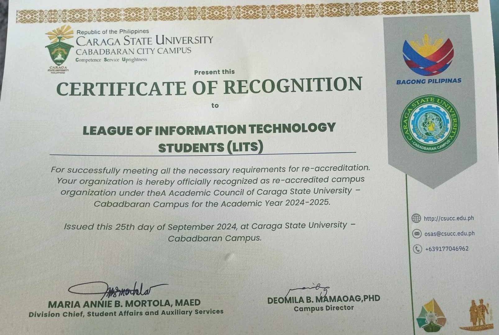
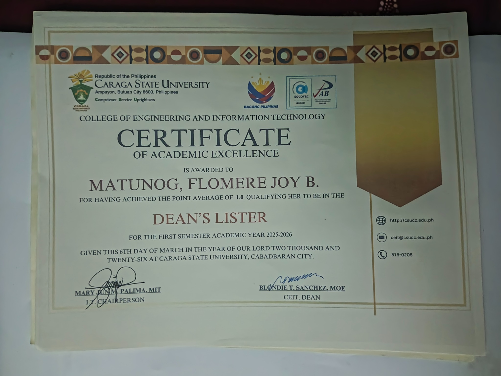
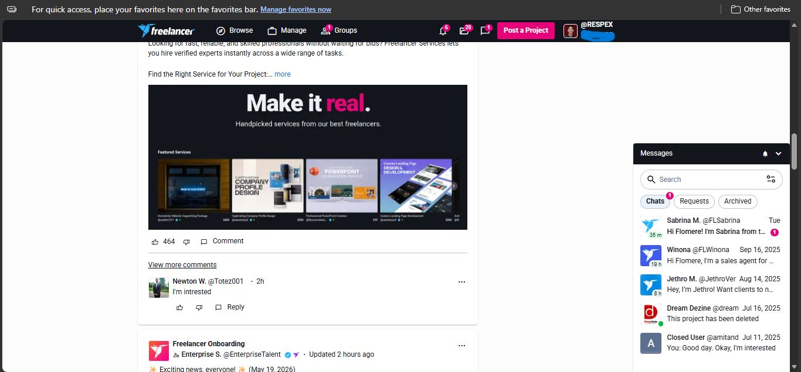
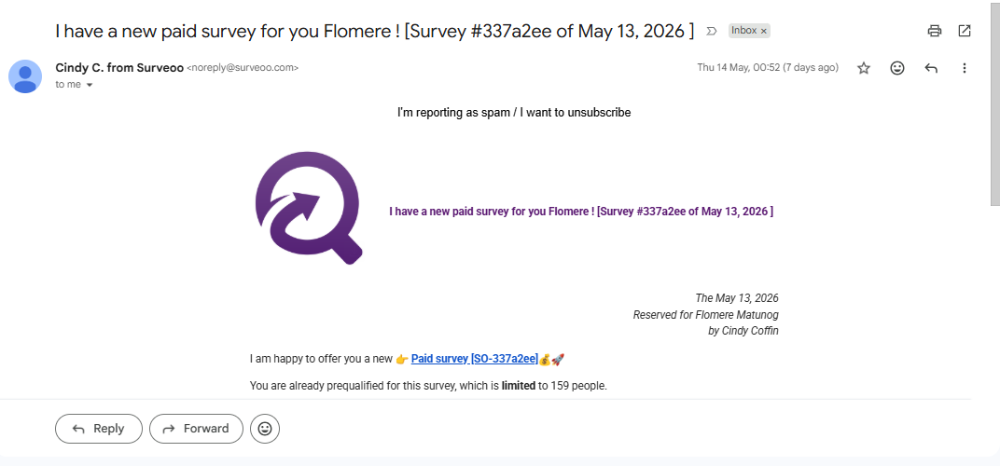
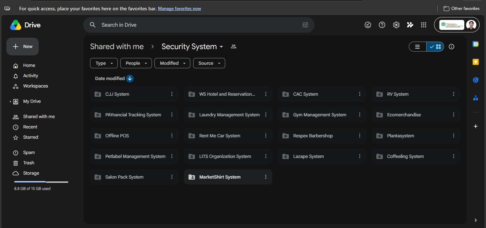
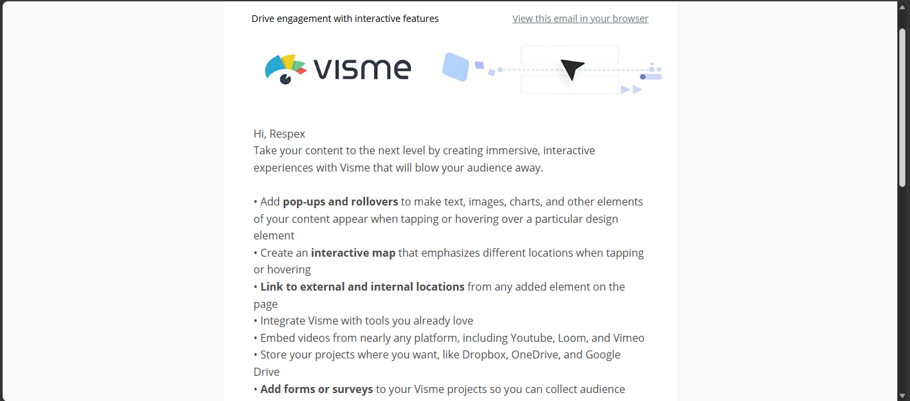

---

## 📌 Portfolio Overview

This GitHub portfolio documents my growth as a **BSIT student** through certificates, academic achievements, internship experience, freelance conversations, commissions, negotiations, online opportunities, and system development projects.

---

## 🏆 Certificates and Academic Achievements

<table>
<tr>
<td width="50%" align="center">

### 🌐 Cisco Networking Academy Certificate

</td>
<td width="50%" valign="top">

This certificate was awarded after successfully completing the **Programming Essentials in C++** course through the **Cisco Networking Academy Program**.

The course introduced programming fundamentals using the C++ programming language. Topics included variables, loops, conditional statements, arrays, functions, object-oriented programming concepts, and logical problem-solving techniques.

The training strengthened foundational programming knowledge and improved understanding of software logic, algorithm creation, debugging, and coding structure.

### 💡 What Happened Here?

- Programming lessons and coding exercises were completed.
- Logical reasoning and coding activities were practiced.
- Object-oriented programming concepts were introduced.
- Assessments and technical activities were successfully passed.

### 🛠 Skills and Experience Gained

- C++ Programming
- Logical reasoning
- Algorithm development
- Object-Oriented Programming
- Problem-solving
- Coding and debugging

</td>
</tr>

<tr>
<td width="50%" align="center">

### 🏨 Radisson Blu Cebu Internship  

</td>
<td width="50%" valign="top">

This certificate confirms successful completion of **500 hours of On-the-Job Training (OJT)** in the Information Technology Department of **Radisson Blu Cebu**.

The internship provided real-world exposure to enterprise-level IT operations in a professional hospitality environment. Responsibilities involved assisting in troubleshooting computer systems, supporting IT-related concerns, observing technical operations, and improving workplace communication.

The training served as an opportunity to apply academic knowledge from BSIT studies into practical industry experience while learning professional standards and workplace responsibilities.

### 💡 What Happened Here?

- Technical support and troubleshooting tasks were observed and performed.
- Exposure to workplace IT operations was experienced.
- Professional communication and teamwork were practiced.
- Academic IT knowledge was applied in a real-world environment.

### 🛠 Skills and Experience Gained

- Technical support
- Troubleshooting
- Networking assistance
- Workplace professionalism
- Communication skills
- Enterprise IT exposure

</td>
</tr>

<tr>
<td width="50%" align="center">

### 🖥️ COMPTECH Summer Bootcamp 2025  

</td>
<td width="50%" valign="top">

This certificate was awarded for valuable support and active participation during the **COMPTECH Summer Bootcamp 2025** conducted at Caraga State University – Cabadbaran Campus.

The event focused on improving technical engagement, collaboration, and practical exposure to Information Technology activities. Participants interacted with fellow students, assisted in activities, participated in collaborative tasks, and contributed to the success of the bootcamp.

The bootcamp provided a learning environment that strengthened communication skills, adaptability, teamwork, and involvement in IT-related activities.

### 💡 What Happened Here?

- Students joined technical and collaborative activities.
- Organizational and event support was provided.
- Participants engaged in learning sessions and teamwork.
- Contributions helped the event become successful.

### 🛠 Skills and Experience Gained

- Technical collaboration
- Teamwork and communication
- Event participation
- Adaptability
- Organizational support
- Active learning

</td>
</tr>

<tr>
<td width="50%" align="center">

### 🏅 Certificate of Recognition  

</td>
<td width="50%" valign="top">

This certificate was awarded by **Caraga State University – Cabadbaran City Campus** to the **League of Information Technology Students (LITS)** after successfully fulfilling all university requirements necessary for organizational re-accreditation for Academic Year 2024–2025.

The recognition confirms that the organization maintained active participation, proper documentation, organizational compliance, and leadership coordination required by the university administration. The organization demonstrated responsibility in conducting activities, preparing reports, coordinating with university offices, and maintaining active engagement with students.

As part of the Information Technology community, this recognition reflects dedication to leadership, teamwork, and participation in activities that support BSIT students academically and organizationally.

### 💡 What Happened Here?

- The organization submitted all required documents.
- Officers coordinated with university offices.
- Activities and accomplishments were evaluated.
- The organization successfully passed the accreditation process.
- LITS officially remained recognized by the university.

### 🛠 Skills and Experience Gained

- Leadership and management
- Communication and coordination
- Organizational documentation
- Team collaboration
- Event management
- Responsibility and accountability

</td>
</tr>

<tr>
<td width="50%" align="center">

### 🎓 Dean’s Lister Certificate  

</td>
<td width="50%" valign="top">

This certificate recognizes **Flomere Joy B. Matunog** for achieving a **1.0 Point Average** and qualifying for the **Dean’s List** during the First Semester Academic Year 2025–2026.

The award reflects outstanding academic performance, dedication, discipline, and consistency in Information Technology studies. Achieving this recognition required maintaining excellent grades across technical and theoretical BSIT subjects such as programming, networking, database management, software engineering, and information systems.

This recognition demonstrates commitment to academic excellence and continuous improvement in technical knowledge and problem-solving abilities.

### 💡 What Happened Here?

- Academic performance was evaluated for the semester.
- High grades across subjects qualified for Dean’s List recognition.
- The university officially recognized academic excellence.
- The achievement reflects consistent effort and discipline.

### 🛠 Skills and Experience Gained

- Analytical thinking
- Technical comprehension
- Academic discipline
- Time management
- Problem-solving
- Continuous learning mindset

</td>
</tr>

<tr>
<td width="50%" align="center">

### 🌍 Freelancer Dashboard  

</td>
<td width="50%" valign="top">

This screenshot shows exploration and engagement within an online freelancing platform where different digital services, project opportunities, and client interactions are available.

The dashboard contains freelance-related activities such as:
- Client messages
- Service promotions
- Digital project opportunities
- Commission-based work
- Freelancer networking

The platform exposes users to online professional environments where IT-related skills such as system development, design, and technical services can be offered.

### 💡 What Happened Here?

- Freelance opportunities and services were explored.
- Online project offers and digital services were observed.
- Client communication systems were accessed.
- Exposure to freelancing environments was experienced.

### 🛠 Skills and Experience Gained

- Freelancing exposure
- Digital entrepreneurship
- Online platform navigation
- Client engagement awareness
- Professional online interaction

</td>
</tr>

<tr>
<td width="50%" align="center">

### 💬 Client Negotiation  

</td>
<td width="50%" valign="top">

This screenshot displays a direct conversation with a potential client discussing freelance work requirements, posting tasks, conditions, responsibilities, and payment arrangements.

The conversation demonstrates real-world communication in freelancing environments where clients explain tasks, negotiate expectations, and provide instructions regarding project responsibilities.

The interaction reflects actual exposure to professional communication and client coordination practices.

### 💡 What Happened Here?

- A client discussed project instructions and task responsibilities.
- Payment details and working conditions were explained.
- Communication regarding expectations and deliverables occurred.
- Freelance negotiation and requirement clarification were practiced.

### 🛠 Skills and Experience Gained

- Communication skills
- Negotiation abilities
- Requirement analysis
- Professional interaction
- Client coordination

</td>
</tr>

<tr>
<td width="50%" align="center">

### 📧 Paid Survey Opportunity  

</td>
<td width="50%" valign="top">

This screenshot shows an email invitation for a paid online survey opportunity received through Gmail.

The email represents exposure to online engagement opportunities and digital earning platforms where users may participate in surveys, feedback systems, or promotional activities in exchange for rewards or compensation.

Although not directly related to software development, the experience reflects awareness of online digital ecosystems and internet-based opportunities.

### 💡 What Happened Here?

- An invitation for an online survey opportunity was received.
- Digital engagement and participation opportunities were presented.
- Exposure to online earning systems was experienced.

### 🛠 Skills and Experience Gained

- Online communication awareness
- Digital platform familiarity
- Exposure to online engagement systems
- Understanding internet-based opportunities

</td>
</tr>

<tr>
<td width="50%" align="center">

### 📩 Security System Share Request  

</td>
<td width="50%" valign="top">

This screenshot shows a Google Drive request involving access to a shared folder named **Security System**.

The image demonstrates collaboration and project-sharing practices commonly used during system development and academic project coordination. Shared folders are important in organizing source codes, documents, files, and development resources among collaborators or project members.

This reflects practical experience in managing digital project resources and collaborative environments.

### 💡 What Happened Here?

- A user requested access to a shared project folder.
- Project collaboration through Google Drive was demonstrated.
- File management and online sharing systems were utilized.

### 🛠 Skills and Experience Gained

- Collaboration and teamwork
- Online file management
- Project coordination
- Digital resource organization
- Cloud storage familiarity

</td>
</tr>
</table>

---

## 📁 System Development Projects

This screenshot shows different system development projects stored and shared through Google Drive, including business systems, reservation systems, organization systems, POS systems, and management systems.

---

## 🎨 Multimedia and UI/UX Exposure

This screenshot shows exposure to **Visme**, a digital content and design platform. It supports interactive content creation, presentations, UI/UX visuals, and multimedia design.

---

## 🛠️ Technical Skills

| Category | Skills |
|---|---|
| 💻 Programming | C++, PHP, JavaScript |
| 🌐 Frontend | HTML, CSS, Responsive Design |
| 🗄️ Database | MySQL, CRUD Operations |
| 🔐 Systems | Authentication, Security Key, OTP |
| 🧩 Development | Web Systems, Dashboards, Management Systems |
| 🧑‍💼 Freelancing | Client Communication, Negotiation |
| 🎨 Multimedia | Graphic Design, Layout Design, UI/UX |
| 📡 IoT | ESP32, Fingerprint Authentication |

---

## 📈 Professional Growth

Through these certificates, freelance experiences, and project activities, I developed stronger skills in communication, negotiation, real-world IT support, software development, academic discipline, project organization, technical documentation, and online collaboration.

---

## 🎯 Career Objective

To become a skilled IT professional specializing in **software development, web technologies, cybersecurity, IoT systems, and freelancing**, while continuously improving my technical and professional competencies.

---

